# 用MonkeyDev调试ipa

## 用Xcode+MonkeyDev去调试砸壳后的YouTube的ipa

* 概述
  * （1）`Xcode`新建`MonkeyDev`的`MonkeyApp`项目
  * （2）设置基本参数
    * `Product`：`youtube`
    * `Organization Identifier`：`com.google.ios`
    * 自动生成包名：`com.google.ios.youtube`
      * 记得要和app真实包名是一致的
  * （3）右键`TargetApp`->`Add Files to youtube`->选择YouTube的`ipa`
    * 注意勾选：
      * `Destination`：`Copy Items if needed`
        * 表示将ipa拷贝过来，而不是只是建立引用（链接）
      * `Added folders`：`Create groups`
  * （4）确保`Targets`是`youtube`（而**不是**youtubeDylib），点击**▶️**按钮去启动调试，即可正常调试
  * 如果遇到各种问题
    * Unable to install
      * Could not inspect the application package
      * There was an internal API error
    * 可以：
      * 多试试几次
      * 或`Xcode`->`Clean Build Folder`，一般均可解决问题

* 详解：

### 新建MonkeyDev项目

* Xcode中新建项目，选`MonkeyDev`->`MonkeyApp`
  * 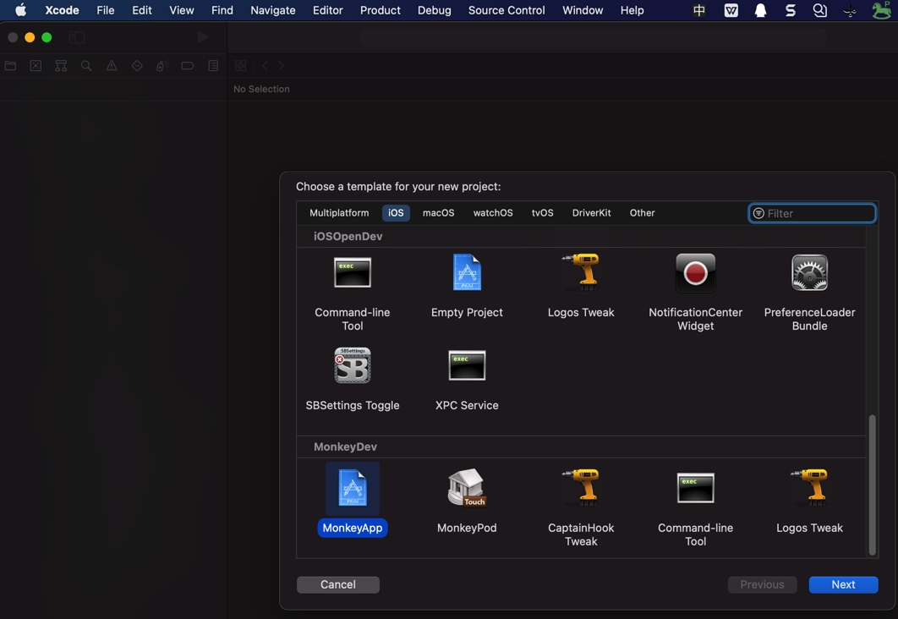
* 填写项目信息
  * 效果
    * 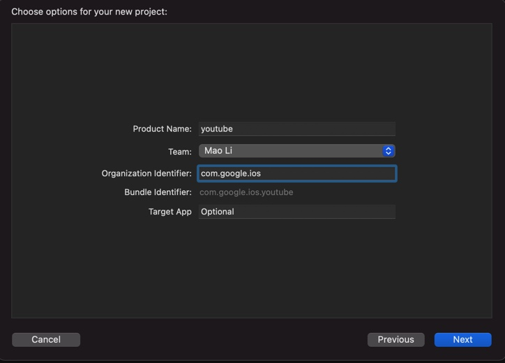
  * 包名：`com.google.ios.youtube`
    * `Product Name`：`youtube`
    * `Organization Identifier`：`com.google.ios`
      * 自动生成包名：`com.google.ios.youtube`
    * `Target App`: `Optional`
* 选择项目保存路径
  * 此处：`/Users/crifan/dev/DevRoot/YoutubeAdsFilter/Xcode/YouTube_1708`
* 新建好了`Xcode`+`MonkeyDev`的项目
  * 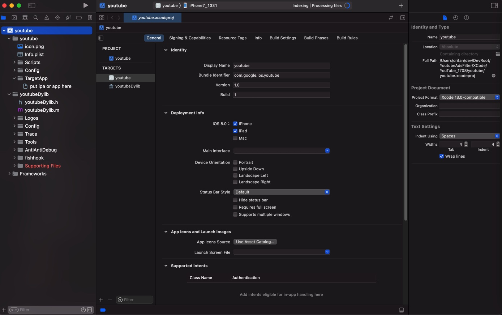

### 导入ipa

* 添加导入（[砸壳](https://book.crifan.org/books/ios_re_crack_shell_ipa/website/)后的）ipa
  * `TargetApp`->右键->`Add Files to`
    * 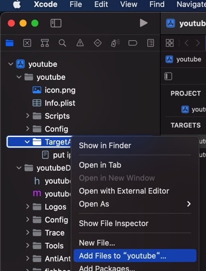
  * 选择ipa文件
    * 图
      * 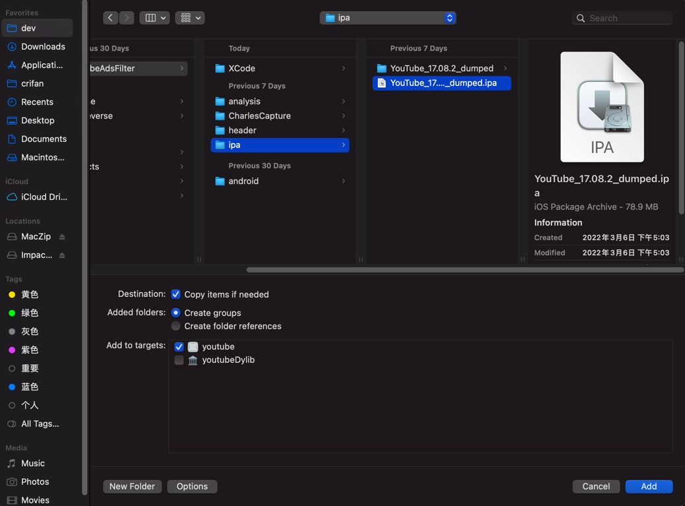
    * 参数
      * `Destination`：`Copy Items if needed`
      * `Added folders`：`Create groups`
  * 添加好了的ipa
    * 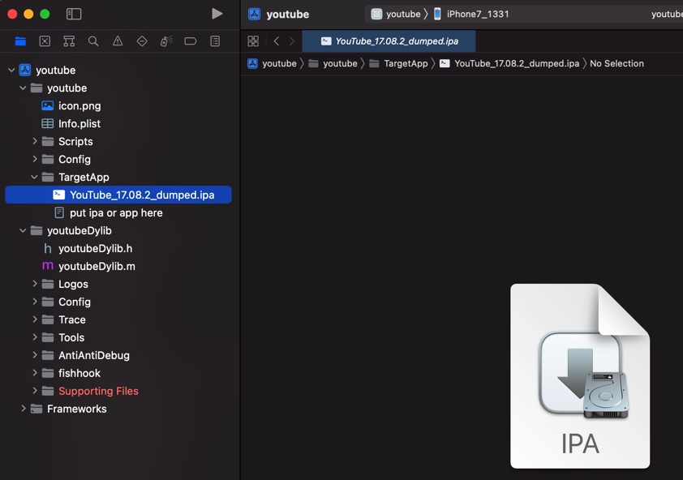

### 确认（调整）MonkeyDev配置参数

注意：默认的`TARGETS`是`youtubeDylib`，要先去切换过去`TARGETS`->`youtube`，才能看到配置。

去`TARGETS`->`youtube` 中确认此处MonkeyDev的配置参数（是你所希望的）：

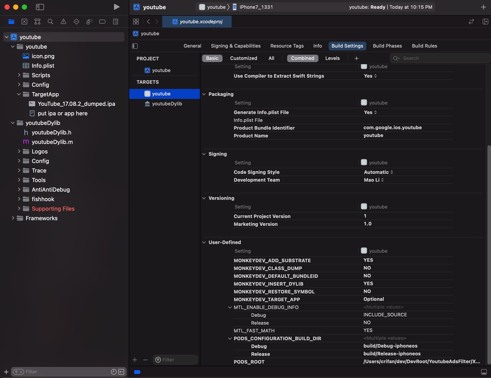

此处参数配置值（多数是默认值）是：

* `MONKEYDEV_ADD_SUBSTRATE` = `YES`
* `MONKEYDEV_CLASS_DUMP` = `NO`
* `MONKEYDEV_DEFAULT_BUNDLEID` = `NO`
* `MONKEYDEV_INSERT_DYLIB` = `YES`
* `MONKEYDEV_RESTORE_SYMBOL`=`NO`
* `MONKEYDEV_TARGET_APP`=`Optional`

### 开始调试ipa

注意：默认的`TARGETS`是`youtubeDylib`，要先去切换过去`TARGETS`->`youtube`，才能正常运行，安装ipa，开始调试。

然后Xcode中即可去调试运行ipa：

* Building
  * 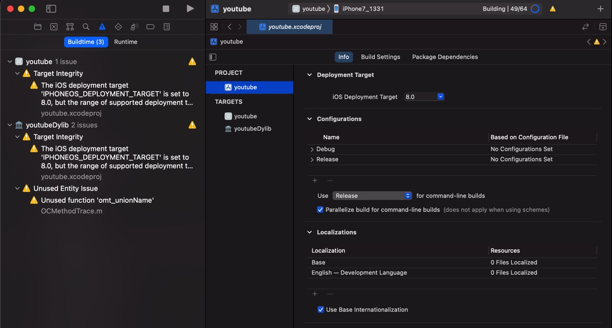
* Installing
  * 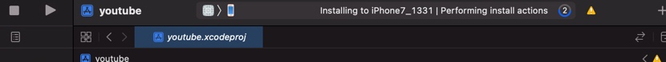
* Running
  * 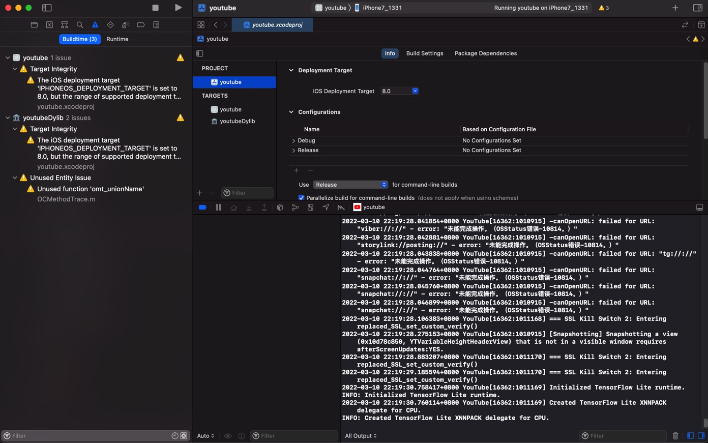

然后可以在`iPhone`真机上调试`YouTube`了：

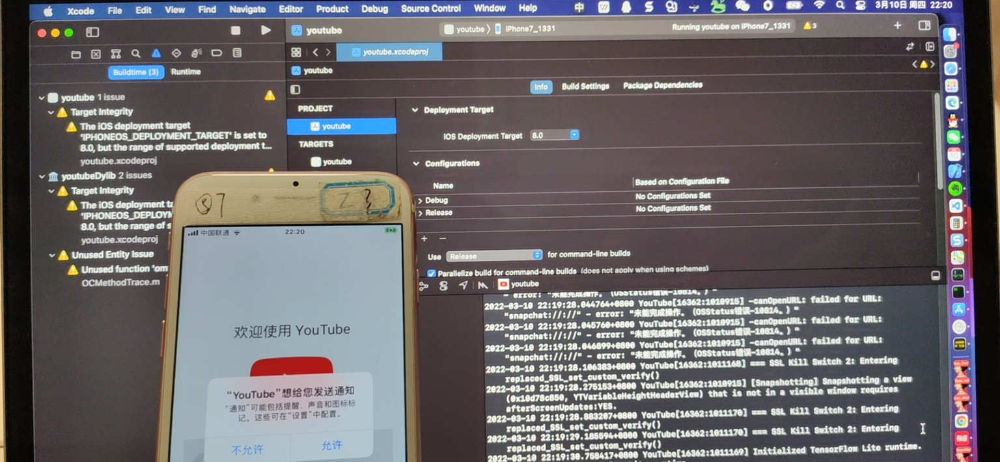
