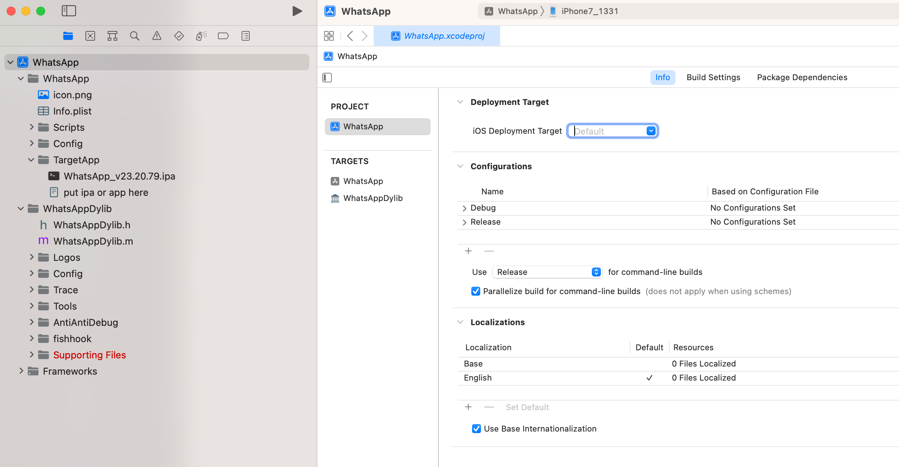
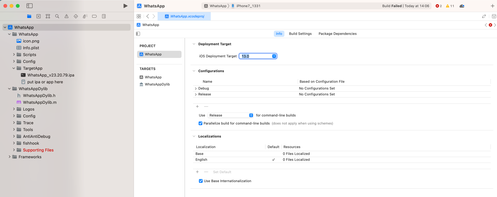
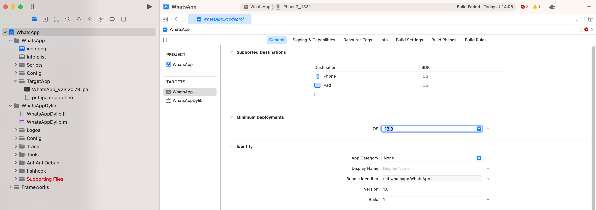

# 常见问题

此处整理MonkeyDev调试编译运行ipa期间的常见问题。

## ld: file not found: /usr/lib/libstdc++.dylib

* 问题

MonkeyDev编译链接时报错：

```bash
ld: file not found: /usr/lib/libstdc++.dylib
```
* 原因：`Xcode 10+`之后=新版XCode，没了`/usr/lib/libstdc++.dylib`
* 解决办法：网上找到缺失的`/usr/lib/libstdc++.dylib`，再安装拷贝到对应目录即可。
* 具体步骤

网上有人弄了个仓库，专门干这事。所以去下载代码和运行对应脚本即可。

```bash
git clone https://github.com/devdawei/libstdc-.git

cd libstdc-

chmod +x install-xcode_11+.sh

./install-xcode_11+.sh
```

## File not found: /xxx/arc/libarclite_iphoneos.a

* 问题

MonkeyDev调试ipa报错：

```bash
File not found: /Applications/Xcode.app/Contents/Developer/Toolchains/XcodeDefault.xctoolchain/usr/lib/arc/libarclite_iphoneos.a
```

* 原因：没有设置PROJECT中的iOS部署目标的iOS版本
  * 导致是默认的值`Default`=空值
    * 
* 解决办法：去设置PROJECT中的iOS部署目标的iOS版本
* 具体操作
  * 把项目的`PROJECT`->`Info`->`Deployment Target`->`iOS Deployment Target`从默认的`Default`=空值，改为`iOS 13.0`
    * 
    * 注意：尽量保持和`Targets`->ProjectName->`General`->`Minimum Deployment`中的`iOS 13.0` 的值一致
      * 
