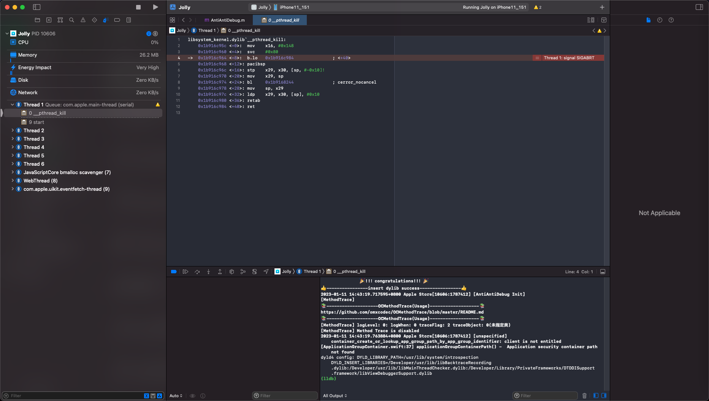
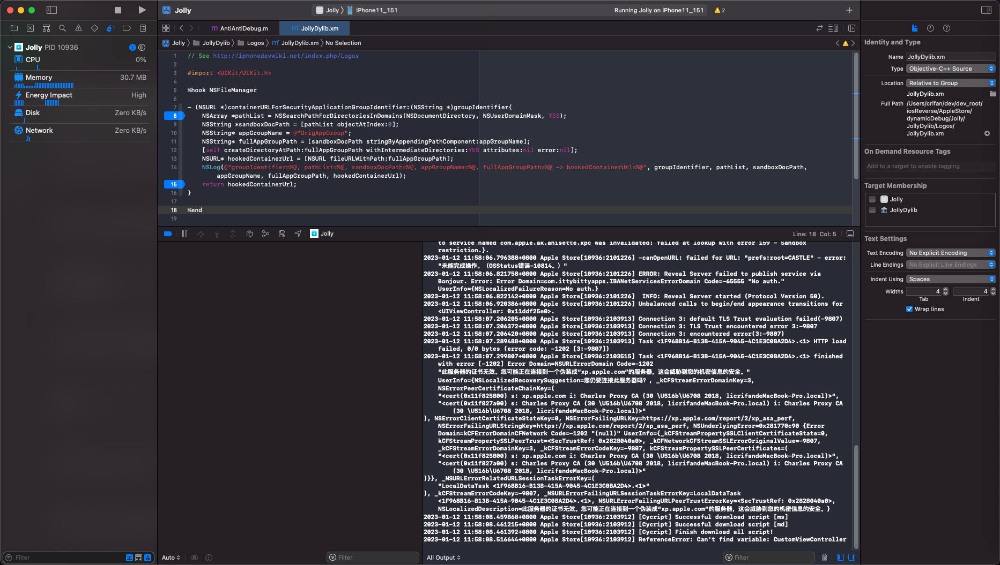
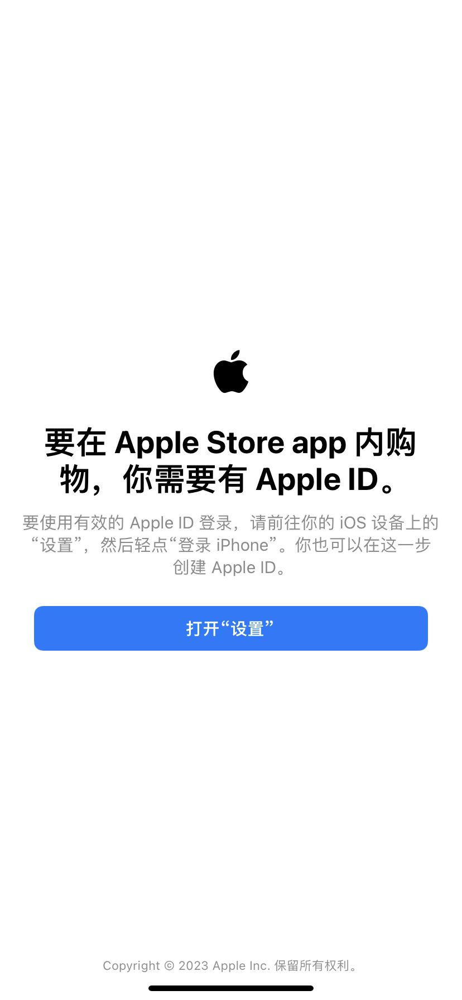
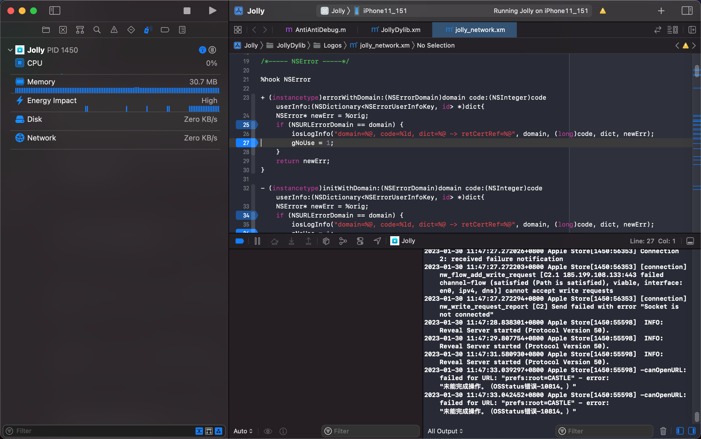
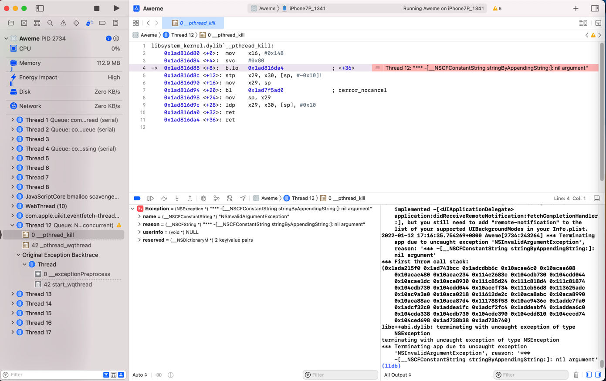

# 调试时各种崩溃和异常

TODO：

* 【未解决】XCode+MonkeyDev调试iOS的ipa除了首次外后续调试均会异常
* 【未解决】iOS逆向AppleStore：为何MonkeyDev调试安装ipa后运行会出现各种出错

---

用MonkeyDev调试ipa期间，经常会遇到：各种的崩溃和异常

## 现象

* MonkeyDev调试ipa的各种崩溃和异常
  * AppleStore
    * app group path问题
      * ` [unspecified] container_create_or_lookup_app_group_path_by_app_group_identifier: client is not entitled`
        * 
    * Charles抓包证书出错问题 = 无法抓包，会报证书问题
      * 举例
        * 【未解决】MonkeyDev调试Apple Store报错：此服务器的证书无效。您可能正在连接到一个伪装成xp.apple.com的服务器，这会威胁到您的机密信息的安全
          * 
    * （从iCloud）同步Apple账户失败 = 账号登录问题：导致后续显示`打开设置`页面，让转去设置中去登录账号
      * 举例
        * 【未解决】iOS逆向AppleStore点击打开设置报错canOpenURL failed for URL prefs:root=CASTLE error 未能完成操作 OSStatus错误 -10814
          * 
          * 
        * 【已解决】iOS逆向AppleStore：打开设置报错NSOSStatusErrorDomain Code -10814 _LSLine 225 _LSFunction _LSDOpenClient openURL
        * 【未解决】iOS逆向AppleStore：无法自动登录Apple账号
        * 【未解决】iOS逆向AppleStore：官网版本和砸壳版本对比找区别
        * 【未解决】iOS逆向AppleStore：砸壳版本调试出现各种问题
  * 抖音
    * NSString空字符串崩溃问题
      * 举例
        * 【规避解决】XCode的MonkeyDev调试抖音ipa崩溃：__NSCFConstantString stringByAppendingString nil argument
          * 
        * 【未解决】通过XCode给stringByAppendingString加断点调试寻找抖音崩溃原因
        * 【已解决】尝试解决XCode的MonkeyDev抖音ipa调试崩溃：hook函数stringByAppendingString
    * 等等

## 原因

* 根本原因
  * 概述：entitlement权限丢失
  * 细节
    * MonkeyDev调试ipa期间，会重新打包，会丢失掉原先app内部的完整的entitlement权限
    * 然后只使用了默认的最最基本的entitlement权限
    * 导致原先app的内置的很多其他对于app运行期间极其重要的entitlement权限，就丢失了
    * 所以就会导致后续运行期间，出现各种：崩溃和异常

### 底层技术细节

比如用MonkeyDev去调试`Apple Store`的ipa来说：

Xcode的编译期间的log可以看出编译过程是：

```bash
/usr/bin/codesign --force --sign 846361C864F687841B120144B1F1D0770BCB0EE6 --entitlements /Users/crifan/Library/Developer/Xcode/DerivedData/Jolly-edtiyeefjwnsmtdjblcgpzxtpvnt/Build/Intermediates.noindex/Jolly.build/Debug-iphoneos/Jolly.build/Jolly.app.xcent --timestamp\=none --generate-entitlement-der /Users/crifan/Library/Developer/Xcode/DerivedData/Jolly-edtiyeefjwnsmtdjblcgpzxtpvnt/Build/Products/Debug-iphoneos/Jolly.app
```

其中用到的`Jolly.app.xcent`，是：

（不论是否开启`CODE_SIGN_INJECT_BASE_ENTITLEMENTS`，都会使用的，通过默认的entitlement的模板所生成的）

默认的，内容非常少的，entitlement模板内容：

* `/Users/crifan/Library/Developer/Xcode/DerivedData/Jolly-edtiyeefjwnsmtdjblcgpzxtpvnt/Build/Intermediates.noindex/Jolly.build/Debug-iphoneos/Jolly.build/DerivedSources/Entitlements.plist`

```xml
<?xml version="1.0" encoding="UTF-8"?>
<!DOCTYPE plist PUBLIC "-//Apple//DTD PLIST 1.0//EN" "http://www.apple.com/DTDs/PropertyList-1.0.dtd">
<plist version="1.0">
<dict>
    <key>application-identifier</key>
    <string>3WRHBBSBW4.com.apple.store.Jolly</string>
    <key>com.apple.developer.team-identifier</key>
    <string>3WRHBBSBW4</string>
    <key>get-task-allow</key>
    <true/>
</dict>
</plist>
```

从而覆盖掉

* 原始的，内容非常全的entitlement内容 == app原始的entitlement内容

```xml
<?xml version="1.0" encoding="UTF-8"?>
<!DOCTYPE plist PUBLIC "-//Apple//DTD PLIST 1.0//EN" "http://www.apple.com/DTDs/PropertyList-1.0.dtd">
<plist version="1.0">
<dict>
    <key>com.apple.watchlist.private</key>
    <true/>
    <key>com.apple.authkit.client.private</key>
    <true/>
    <key>com.apple.developer.associated-domains</key>
    <array>
        <string>applinks:www.apple.com</string>
        <string>applinks:www.apple.com.cn</string>
        <string>applinks:concierge.apple.com</string>
        <string>applinks:reserve-prime.apple.com</string>
        <string>applinks:reserve-gb.apple.com</string>
        <string>applinks:reserve-cn.apple.com</string>
        <string>webcredentials:www.apple.com</string>
    </array>
    <key>com.apple.private.tcc.allow</key>
    <array>
        <string>kTCCServiceMediaLibrary</string>
        <string>kTCCServiceAddressBook</string>
    </array>
    <key>com.apple.accounts.idms.fullaccess</key>
    <true/>
    <key>com.apple.developer.pass-type-identifiers</key>
    <array>
        <string>MT9US5E2G8.*</string>
    </array>
    <key>application-identifier</key>
    <string>W74U47NE8E.com.apple.store.Jolly</string>
    <key>com.apple.accounts.appleaccount.fullaccess</key>
    <true/>
    <key>com.apple.itunesstored.private</key>
    <true/>
    <key>com.apple.private.MobileGestalt.AllowedProtectedKeys</key>
    <array>
        <string>UniqueDeviceID</string>
        <string>SerialNumber</string>
        <string>IntegratedCircuitCardIdentifier</string>
        <string>InternationalMobileEquipmentIdentity</string>
        <string>InternationalMobileEquipmentIdentity2</string>
        <string>IntegratedCircuitCardIdentifier2</string>
    </array>
    <key>fairplay-client</key>
    <string>187241837</string>
    <key>com.apple.Contacts.database-allow</key>
    <true/>
    <key>com.apple.developer.siri</key>
    <true/>
    <key>com.apple.private.applemediaservices</key>
    <true/>
    <key>com.apple.ap.adservicesd.statusconditionservice</key>
    <true/>
    <key>com.apple.developer.usernotifications.time-sensitive</key>
    <true/>
    <key>com.apple.private.appstored</key>
    <array>
        <string>IAPHistory</string>
    </array>
    <key>com.apple.springboard.opensensitiveurl</key>
    <true/>
    <key>com.apple.developer.in-app-payments</key>
    <array>
        <string>com.apple.ASA_AOS</string>
        <string>com.apple.ASA_EPC</string>
        <string>com.apple.ASA_AOS_KRYPTON</string>
        <string>com.apple.ASA_EPC_KRYPTON</string>
        <string>com.apple.ASA-AOS-ALT</string>
    </array>
    <key>com.apple.security.application-groups</key>
    <array>
        <string>group.com.apple.store.Jolly</string>
    </array>
    <key>com.apple.security.exception.shared-preference.read-write</key>
    <array>
        <string>com.apple.AvatarUI.Staryu</string>
        <string>com.apple.animoji</string>
    </array>
    <key>com.apple.developer.associated-appclip-app-identifiers</key>
    <array>
        <string>W74U47NE8E.com.apple.store.Jolly.Clip</string>
    </array>
    <key>com.apple.proactive.PersonalizationPortrait.Topic.readOnly</key>
    <true/>
    <key>com.apple.private.ind.client</key>
    <true/>
    <key>com.apple.security.exception.mach-lookup.global-name</key>
    <array>
        <string>com.apple.AppleMediaServicesUIDynamicService</string>
        <string>com.apple.appstored.xpc</string>
        <string>com.apple.proactive.PersonalizationPortrait.Topic.readOnly</string>
        <string>com.apple.corefollowup.agent</string>
        <string>com.apple.ndoagent</string>
        <string>com.apple.ind.xpc</string>
    </array>
    <key>aps-environment</key>
    <string>production</string>
    <key>com.apple.developer.default-data-protection</key>
    <string>NSFileProtectionCompleteUntilFirstUserAuthentication</string>
    <key>com.apple.security.exception.shared-preference.read-only</key>
    <array>
        <string>com.apple.suggestions</string>
    </array>
    <key>com.apple.security.exception.files.absolute-path.read-only</key>
    <array>
        <string>/var/mobile/Library/Preferences/com.apple.suggestions.plist</string>
    </array>
    <key>com.apple.private.ndoagent</key>
    <true/>
    <key>com.apple.ap.adservicesd.statusconditionclient.allow_read</key>
    <true/>
    <key>com.apple.private.tcc.allow-or-regional-prompt</key>
    <array>
        <string>kTCCServiceAddressBook</string>
    </array>
    <key>com.apple.developer.team-identifier</key>
    <string>MT9US5E2G8</string>
    <key>com.apple.coretelephony.Identity.get</key>
    <true/>
    <key>com.apple.private.avatar.store</key>
    <true/>
    <key>com.apple.accounts.appleidauthentication.defaultaccess</key>
    <true/>
    <key>com.apple.features.all-access</key>
    <true/>
</dict>
</plist>
```

注，查看entitlement的方式：

```bash
crifan@licrifandeMacBook-Pro  ~/dev/dev_root/iosReverse/AppleStore/fromiPhone11/AppleStore_TrollStoreInstalledOk_inited/Bundle/46830BF1-0DBF-4EE2-8084-1C0404BD7555  codesign -d --entitlements - Apple\ Store.app
Executable=/Users/crifan/dev/dev_root/iosReverse/AppleStore/fromiPhone11/AppleStore_TrollStoreInstalledOk_inited/Bundle/46830BF1-0DBF-4EE2-8084-1C0404BD7555/Apple Store.app/Apple Store
...
```

或：

```bash
crifan@licrifandeMacBook-Pro  ~/dev/dev_root/iosReverse/AppleStore/dynamicDebug/Xcode/Jolly/Jolly/TargetApp  ldid -e Apple\ Store.app/Apple\ Store > AppleStore_embeded_entitlements.plist
```

由此导致了：

后续app正常运行期间，由于丢失了所需要的各种的entitlement权限，而运行崩溃或异常

举例：

丢失了原有的app group的entitlement权限的设置：

```xml
    <key>com.apple.security.application-groups</key>
    <array>
        <string>group.com.apple.store.Jolly</string>
    </array>
```

而导致了后续的app group path的问题：

```bash
2023-01-11 14:43:19.763884+0800 Apple Store[10606:1787412] [unspecified] container_create_or_lookup_app_group_path_by_app_group_identifier: client is not entitled
[ApplicationGroupContainer.swift:37] applicationGroupContainerPath() -  Application security container path not found
```

## 解决办法

### 彻底解决

* 彻底解决：暂时无解
  * 之前尝试解决，但是无法解决
    * 【无法解决】iOS逆向app：更改配置尝试解决MonkeyDev调试安装ipa各种错误
    * 抖音 = Aweme
      * 【记录】研究XCode+MonkeyDev后续调试ipa但不签名codesign能否解决崩溃问题
      * 【未解决】XCode的MonkeyDev参考和学习ipa安装过程和机制生成安装后不崩溃的抖音ipa
      * 【记录】分析XCode+MonkeyDev编译抖音ipa详细过程的log
    * AppleStore = Jolly.app
      * 【基本解决】iOS逆向Xcode中codesign：Xcode参数CODE_SIGN_INJECT_BASE_ENTITLEMENTS
      * 【未解决】iOS逆向AppleStore：codesign通过额外参数--preserve-metadata实现保留entitlement
      * 【未解决】iOS逆向AppleStore：Xcode编译时codesign不传入--entitlements参数即不使用entitlement文件
      * 【未解决】iOS逆向AppleStore：Xcode编译时codesign时如何指定合适的entitlement权限文件
      * 【未解决】iOS逆向AppleStore：Xcode编译时禁用codesign代码签名
      * 【未解决】iOS逆向Xcode中codesign：寻找BaseEntitlements.plist来源
      * 【未解决】iOS逆向Xcode中codesign：研究DerivedSources/Entitlements.plist的来源
      * 【未解决】iOS逆向Xcode中codesign：研究xcbuild文件的编译过程细节
      * 【无法解决】iOS逆向Xcode中codesign：找.app.xcent文件内容来源自己更改或替换默认内容
      * 【未解决】iOS逆向AppleStore：Xcode编译时codesign给参数--entitlements指定自己的entitlement文件
      * 【基本解决】iOS逆向Xcode中codesign：搞懂DerivedSources/Entitlements.plist的内容的来源
      * 【未解决】iOS逆向AppleStore：Xcode编译时如何保留修改后的entitlement文件或重签名的app
      * 【未解决】iOS逆向AppleStore：研究Xcode编译过程找二进制中entitlement丢失的原因
      * 【未解决】iOS逆向Xcode中自己指定entitlement：禁用自动管理签名
      * 【未解决】iOS逆向Xcode的codesign：看看编译时各种环境变量是否有用的
      * 【未解决】研究MonkeyDev的XCode中/opt/MonkeyDev/Tools/pack.sh脚本的内部逻辑
      * 【未解决】iOS逆向AppleStore：自己单独运行命令设置完整的entitlement权限
      * 【已解决】XCode中查看Build Phases中Run Script的sh脚本的log输出
      * 【未解决】给MonkeyDev的pack.sh加上echo的log日志调试分析运行逻辑
      * 【未解决】iOS逆向AppleStore：Xcode的build期间如何在Sign之后执行自定义命令
      * 【未解决】iOS逆向AppleStore：导致异常版本中的二进制中丢失plist的entitlement等信息的原因
      * 【已解决】Xcode调试ipa或app：确保项目debug-ipa正常调试运行

### 规避办法workaround

* 规避办法：改用其他调试手段
  * 优先推荐：`Xcode+iOSOpenDev`
    * [iOS逆向调试：Xcode+iOSOpenDev](https://book.crifan.org/books/ios_re_debug_xcode_iosopendev/website/)
  * 其次可以考虑：`debugserver+lldb`
    * [iOS逆向调试：debugserver+lldb](https://book.crifan.org/books/ios_re_debug_debugserver_lldb/website)
